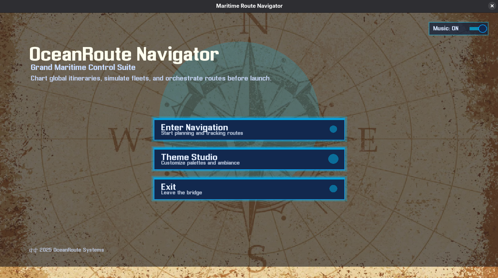
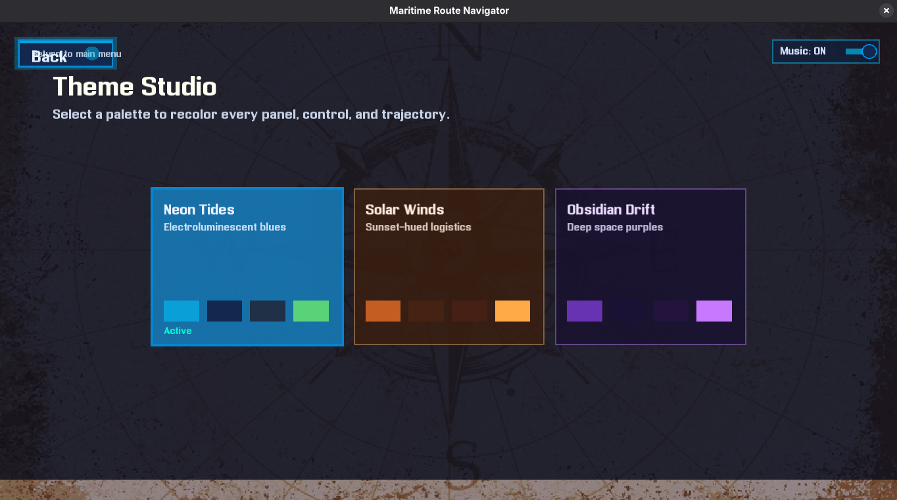
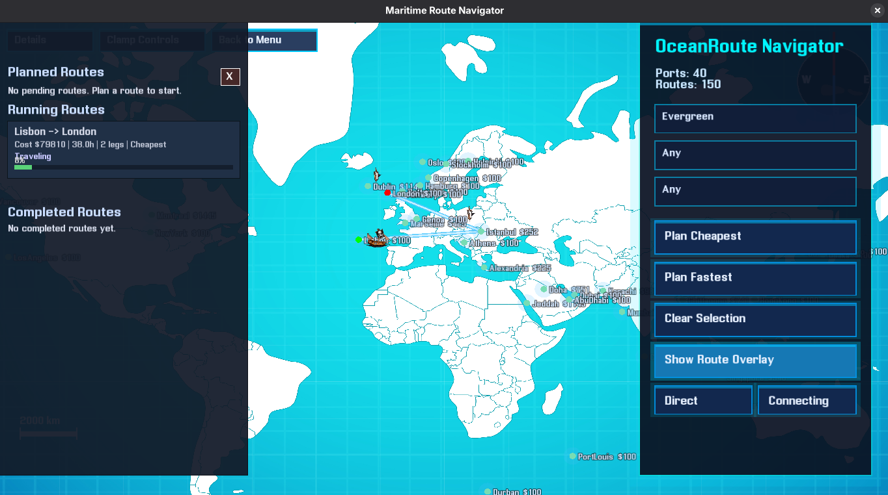
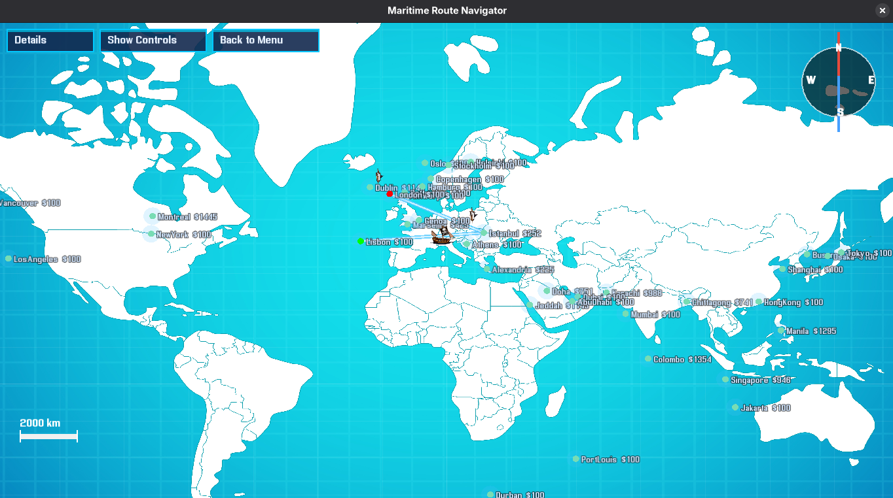

# OceanRoute Navigator

Global route-planning playground built with C++17 and SFML that lets you choreograph ocean freight, test schedule assumptions, and visualize vessels in motion before they ever leave port.






## Highlights
- **Dual planning modes** – pick Cheapest (cost-weighted) or Fastest (time-weighted) searches running on a custom Dijkstra/A* hybrid with bespoke queues, stacks, and heaps.
- **Schedule-aware filters** – lock in preferred carriers, departure dates, and times before generating an itinerary; fallbacks are surfaced when the preference cannot be met.
- **World map cockpit** – zoom, pan, and hover any port to inspect queue depth, handling fees, and live route overlays rendered over a stylized world projection.
- **Fleet simulation** – launch a planned route to animate boats, dock queues, layovers, and extra surcharges produced by congestion at the destination port.
- **Route editing tools** – toggle direct vs. connecting legs, highlight individual itineraries, and remove intermediate ports to force a replanned path.
- **Theme studio + ambience** – ship with Neon, Solar, and Obsidian palettes, menu artwork, and loopable bridge ambience (`assets/music.wav`).

## Data Inputs
| File | Purpose | Format |
| --- | --- | --- |
| `Routes.txt` | Defines every available sailing leg. | `Origin Destination DD/MM/YYYY HH:MM HH:MM CostUSD Carrier` (arrival day auto-rolls if it wraps past midnight).
| `PortCharges.txt` | Lists each port's per-day dock charge. | `PortName ChargePerDayUSD` (one entry per line).

Keep both files beside the executable; the loader runs `parsePortCharges(...)` and `parseRoutes(...)` during startup.

## Architecture Notes
- Built around a static graph (`Graph`, `RouteEdge`, `Port`) with adjacency lists populated from the text files.
- Uses custom containers (`DynamicArray`, `CustomQueue`, `CustomStack`, `MinHeap`) to stay close to core data-structure coursework requirements.
- Pathfinding mixes Dijkstra and A* heuristics (uses haversine distance when optimizing for time) and can temporarily exclude ports when removing intermediate stops.
- Simulation updates boats at 60 FPS, advances leg progress, applies dock-queue waits, and tracks planned, running, and completed itineraries.
- SFML powers rendering, audio, and input; assets in `assets/` cover the map texture, directional boat sprites, UI font, and music.

## Setup
1. **Install prerequisites (Linux example)**
   ```bash
   sudo apt update && sudo apt install build-essential libsfml-dev
   ```
2. **Build**
   ```bash
   cd /home/unknown/Downloads/DataStructure_i24-3164_i24-3143_Project
   g++ -std=c++17 main1.cpp -o OceanRouteNavigator \
       -lsfml-graphics -lsfml-window -lsfml-system -lsfml-audio
   ```
3. **Run**
   ```bash
   ./OceanRouteNavigator
   ```

> **Tip:** Keep `assets/`, `Routes.txt`, and `PortCharges.txt` in the working directory so the app can find fonts, textures, and data.

## Using the App
- **Main menu** – choose *Enter Navigation* to launch the map or *Theme Studio* to preview palettes and music controls.
- **Selecting ports** – left-click ports on the map to set origin and destination (first click = origin, second = destination). Tooltips show charges and queue length.
- **Planning routes**
  1. Choose preferred carriers via the company dropdown (required before planning).
  2. Optionally pick a departure date/time.
  3. Click *Plan Cheapest* or *Plan Fastest*.
  4. Use *Direct* / *Connecting* toggles plus *Show Route Overlay* to filter visuals.
- **Editing itineraries** – highlight a route, press *Remove Port*, then click an intermediate waypoint to rebuild the plan without that stop.
- **Launching simulations** – from the side panel, hit *Start* on any planned route to spawn an animated vessel. Monitor running and completed legs from the same panel.
- **Map controls** – mouse wheel to zoom, left-drag empty ocean to pan, hover routes to inspect carrier, schedule, delay, and surcharge details.
- **Panels & navigation** – top-left buttons toggle the details panel, clamp the navigation controls, or return to the main menu.

## Assets & Customization
```
assets/
├── map.png         # background map
├── east.png        # boat sprite facing east
├── west.png
├── north.png
├── south.png
├── menu.png        # menu backdrop
├── title.ttf       # UI font
└── music.wav       # ambient loop
```
Replace any of these with your own branding to reskin the experience; keep the filenames identical or adjust the loader paths in `main1.cpp`.

## Troubleshooting
- **Blank window / missing text** – ensure SFML can locate `title.ttf` and `map.png`; the console logs warnings if assets fail to load.
- **No music** – confirm PulseAudio/ALSA is available and that `assets/music.wav` exists.
- **Routes not appearing** – validate `Routes.txt` lines use single spaces and no trailing characters; the parser expects strict tokens.

## Next Steps
- Add more sample routes/charges to stress-test the docking queues.
- Consider exporting planned itineraries (CSV/JSON) for downstream analysis.
- Ship unit-style tests for the custom containers and graph utilities if you intend to extend the planner.
